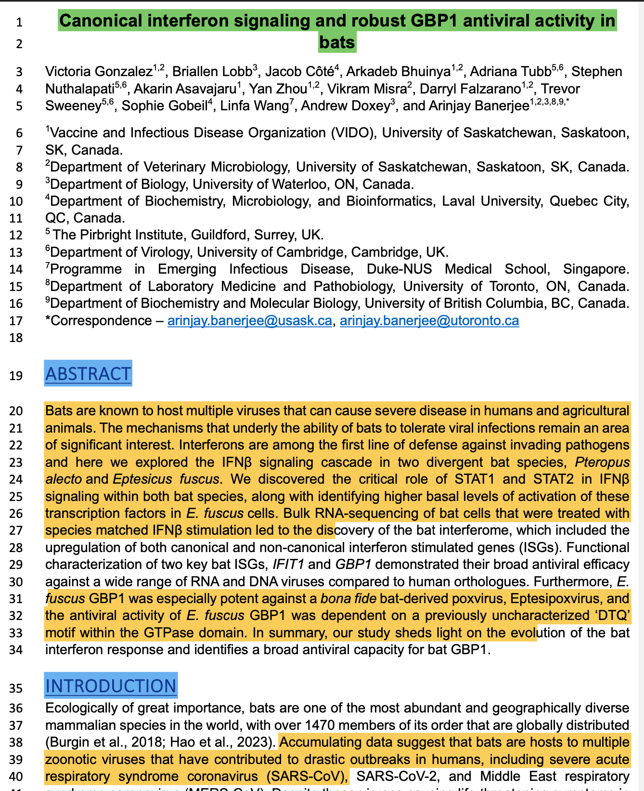
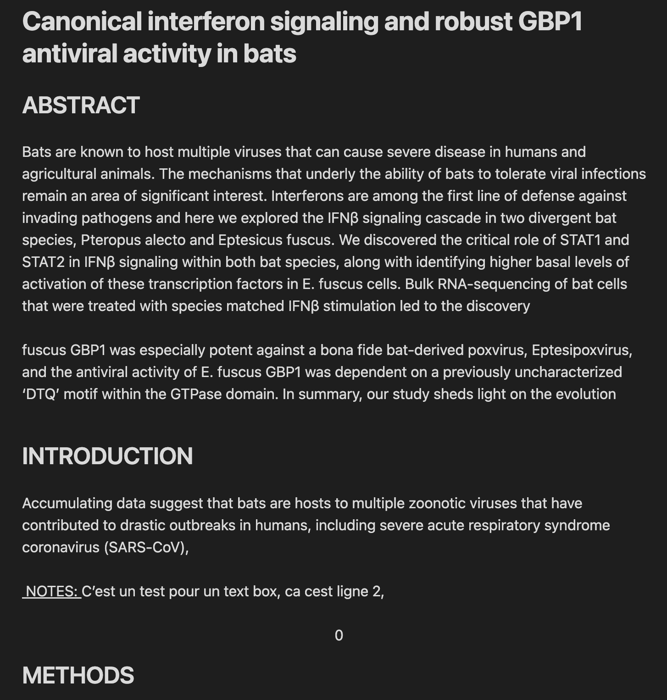

# NoteTaker
NoteTaker is a python script that convert highlighted PDFs to markdown notes. Given a source directory, NoteTaker will scan recursively updated PDFs to format it in a condensed markdown. 

You can also add annotations on the PDF and NoteTaker will add them to the md files. It is best used with obsidian where you give it your obsidian vault as the target directory. 

NoteTaker will recreate your folder three in your vault for better organisation.

## Example

### Annoted pdf

### Obsidian markdown

